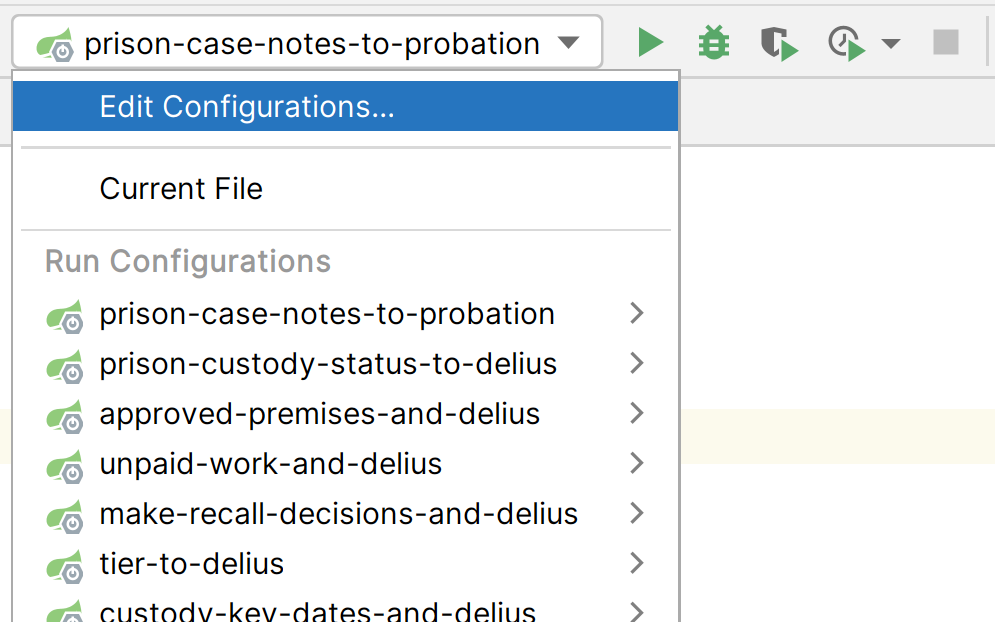

# Probation Integration Services

[](https://operations-engineering-reports.cloud-platform.service.justice.gov.uk/public-report/hmpps-probation-integration-services "Link to report")
[](https://github.com/ministryofjustice/hmpps-probation-integration-services/actions/workflows/security.yml)
[](https://sonarcloud.io/summary/new_code?id=ministryofjustice_hmpps-probation-integration-services)
[](https://sonarcloud.io/summary/new_code?id=ministryofjustice_hmpps-probation-integration-services)
[](https://sonarcloud.io/summary/new_code?id=ministryofjustice_hmpps-probation-integration-services)
[](https://sonarcloud.io/summary/new_code?id=ministryofjustice_hmpps-probation-integration-services)


A collection of small, domain-focused integrations to support HMPPS Digital services that need to interact with 
probation data. Typically, these integration services will perform translations between HMPPS and Delius domain 
concepts, and are responsible for:
* publishing REST endpoints to read existing data from the Delius database
* listening for HMPPS Domain Event messages and writing data into the Delius database

# Project
## Goals
This project is intended to reduce the surface area of larger integration systems (e.g. [Community API](https://github.com/ministryofjustice/community-api)),
and to replace other components (e.g. [Case Notes to Probation](https://github.com/ministryofjustice/case-notes-to-probation))
with simpler services that have direct access to the Delius database.

With this in mind, we aim to:
* Support HMPPS Digital teams by building and deploying at pace
* Separate overlapping domain concepts by creating smaller, more focused services
* Simplify the developer experience by unifying common approaches and streamlining workflows

## Tooling
* Code is written in [Kotlin](https://kotlinlang.org/), using [Spring Boot](https://spring.io/projects/spring-boot)
* Built and tested as a multi-project [Gradle](https://gradle.org/) build
* Unit tests with [JUnit 5](https://junit.org/) and [Mockito](https://mockito.org/)
* Integration tests with [Spring Boot Test](https://docs.spring.io/spring-boot/docs/current/reference/html/features.html#features.testing), [Wiremock](https://wiremock.org/) and [H2](https://www.h2database.com/)
* End-to-end testing with [Playwright](https://playwright.dev/) - see [End-to-end tests](https://github.com/ministryofjustice/hmpps-probation-integration-services#end-to-end-tests)
* Container images are built with [Jib](https://github.com/GoogleContainerTools/jib#readme), and pushed
  to [GitHub Packages](https://github.com/orgs/ministryofjustice/packages?repo_name=hmpps-probation-integration-services)
* Code formatting by [IntelliJ IDEA formatter](https://www.jetbrains.com/help/idea/command-line-formatter.html),
  according to [Kotlin Coding Conventions](https://kotlinlang.org/docs/coding-conventions.html)
* Continuous integration with [GitHub Actions](https://help.github.com/en/actions)

## Structure
This repository is structured as a monorepo containing an individually deployable project per integration service.

The directory layout is as follows:
```
├── .github           ~ GitHub actions workflows and configuration
├── .idea             ~ IntelliJ IDEA configuration
├── buildSrc          ~ Gradle build scripts
├── doc               ~ Technical documentation and decision records
├── libs              ~ Shared Kotlin libraries
├── projects          ~ Source code for integration service projects
│   ├── project-1
│   ├── ...
│   └── project-n
├── templates         ~ Project templates and shared configuration
└── tools             ~ Operational tools e.g. feature flags and database reports 
```

# Development
The project is configured to enable developers to build/test/run integration services in isolation without the need for 
Docker or remote dependencies.

To set up your development environment:
1. Open the project in [IntelliJ IDEA](https://www.jetbrains.com/idea/). Select "Import project from external model", then "Gradle".
2. To run the tests for a service, right-click the `src/test` folder in the project view and select "Run tests" (See [Test](#test)).
3. To start the service, use the pre-defined run configuration in `.idea/runConfigurations` (See [Run](#run)).

# Build
IntelliJ will automatically build your code as needed. To build using Gradle, follow the instructions below. 

## Gradle
Any tasks you run from the root project, without specifying a project name will be run on all the children. To build the
entire repository using Gradle, run:
```shell
./gradlew build
```

To build just a specific project.
```shell
./gradlew <project-name>:build

# For example,
./gradlew tier-to-delius:build
./gradlew workforce-allocations-to-delius:build
```

Use buildDependents to build and test all projects that depend on a given project (for instance a shared library)
```shell
./gradlew <project-name>:buildDependents

# For example,
./gradlew libs:audit:buildDependents
```

## Docker
To build Docker images locally, run:
```shell
./gradlew jibDockerBuild
```

## Code formatting
Kotlin code is formatted using IntelliJ IDEA's code formatter,
which follows the [Kotlin Coding Conventions](https://kotlinlang.org/docs/coding-conventions.html).

GitHub Actions will automatically fix any formatting issues when you open a pull request. 
You can also use <strong title="Command">⌘</strong><strong title="Option">⌥</strong>**L** (macOS), 
or **Ctrl+Alt+L** (Windows/Linux) to manually reformat your code in IntelliJ IDEA.
See [Reformat file](https://www.jetbrains.com/guide/java/tips/reformat-file/).

# Run
## IntelliJ
In IntelliJ IDEA, a Spring Boot [run configuration](https://www.jetbrains.com/help/idea/run-debug-configuration.html) is
automatically made available for each service. Select it from the toolbar, and click either Run or Debug. The service 
will start in the `dev` profile, which configures any embedded test data and services.



Run configuration files are stored in [.idea/runConfigurations](.idea/runConfigurations).

## Gradle
To run Gradle tasks in a subproject, prepend the task name with the name of the project. Environment variables can be 
used to set the Spring profile. For example,
```shell
SPRING_PROFILES_ACTIVE=dev ./gradlew <project-name>:bootRun
```

### Using a live-like database

A Docker image is available for the Delius database, which is pre-populated with all the Delius stored procedures and
reference data.
To access and run the image, follow the instructions in the [HMPPS Delius Docker Images repository](https://github.com/ministryofjustice/hmpps-delius-docker-images/tree/main/oracledb-18c#running-from-ecr).

Once the database is running, use the `delius-db` profile to connect to it:

```shell
SPRING_PROFILES_ACTIVE=dev,delius-db ./gradlew <project-name>:bootRun
```

# Test
## Integration tests
Integration tests use WireMock JSON files to mock any external services.

The json files for simulations must reside in simulations/mappings in the dev class path. This makes them usable for dev and test.
Any json bodies to add to mappings must live in the simulations/__files directory. These are the defaults for WireMock.
Any json mappings and body files provided in these locations will be automatically loaded and available during dev and test.

The WireMock Server is exposed as a spring bean and can be injected into Spring Boot (Integration) Tests
for verification or adding extra scenarios specific to a test that are not available in json.

```
@Autowired
private val wireMockServer: WireMockServer
```

The strategy with the dev/test profiles is to use a single WireMock server and distinguish any potential duplicate urls using a service name on the url if required.
For example if two urls were used as part of a service 

```
https://hmpps.service1/offender/{crn}
https://hmpps.service2/offender/{crn}
```

When mocking these urls the following would be appropriate (rather than a separate mock server for each service)
```
{wiremockUrl}:{wiremockPort}/service1/offender/{crn}
{wiremockUrl}:{wiremockPort}/service2/offender/{crn}
```

All other concepts of Spring Boot Tests are usable as per Spring documentation.

### Testing with an Oracle Database

By default, integration tests run against an in-memory H2 database.
This can sometimes cause problems where H2 doesn't behave in the same way as the target Oracle database.

To run the integration tests using a slim Oracle database container, use the `oracle` profile:

```shell
SPRING_PROFILES_ACTIVE=integration-test,oracle ./gradlew integrationTest 
```

## End-to-end tests

End-to-end tests are written in [TypeScript](https://www.typescriptlang.org/) using [Playwright](https://playwright.dev/),
in the [hmpps-probation-integration-e2e-tests](https://github.com/ministryofjustice/hmpps-probation-integration-e2e-tests) 
repository.

We run the end-to-end tests in GitHub Actions as part of the 
[deployment pipeline](https://github.com/ministryofjustice/hmpps-probation-integration-services/actions/workflows/pipeline.yml), 
against a real dev/test environment with all dependencies.  Running the tests in a real environment gives us confidence 
that all the integration points involved in the user journey are working correctly before we push changes to production.

You can also run the end-to-end tests from your branch to get early feedback, by following the instructions here: [Manually running a workflow](https://docs.github.com/en/actions/managing-workflow-runs/manually-running-a-workflow).
Note: this will deploy your dev code to the test and preprod environments.

To access internal services from GitHub Actions, we use a repository-level [self-hosted runner](https://docs.github.com/en/actions/hosting-your-own-runners/about-self-hosted-runners)
in MOJ Cloud Platform.
See [06-github-actions-runner.yaml](https://github.com/ministryofjustice/cloud-platform-environments/blob/main/namespaces/live.cloud-platform.service.justice.gov.uk/hmpps-probation-integration/06-github-actions-runner.yaml).
For more information on how this is implemented, see [PI-340](https://dsdmoj.atlassian.net/browse/PI-340).

# Feature flags

This project uses [Flipt](https://www.flipt.io/) to control the availability of certain features.
Feature flags allow us to turn on or off parts of a service in production, decoupling "releases" from "deployments".

Feature flags are managed in the [Flipt dashboard](https://feature-flags.hmpps.service.justice.gov.uk).
You'll need to be in the `ministryofjustice` organisation to access it.

To add a feature flag to your code:

1. Create a new boolean flag in
   the [dev](https://feature-flags-dev.hmpps.service.justice.gov.uk), [preprod](https://feature-flags-preprod.hmpps.service.justice.gov.uk),
   and [prod](https://feature-flags.hmpps.service.justice.gov.uk) dashboards.
2. Update your code to inject the `FeatureFlags` service, and call `enabled("<key>")`. Example:

```kotlin
@Service
class MyService(private val featureFlags: FeatureFlags) {
    fun myMethod() {
        if (featureFlags.enabled("my-flag")) {
            // Feature is enabled, do something
        } else {
            // Feature is disabled, do something else
        }
    }
}
```

For more information about Flipt, check out the [documentation](https://www.flipt.io/docs).

# Deployment
Once the code is built and tested, GitHub Actions deploys the updated images for each service
to [MOJ Cloud Platform](https://user-guide.cloud-platform.service.justice.gov.uk/documentation/concepts/what-is-the-cloud-platform.html).
An AWS Transit Gateway connection enables secure access to dependencies in the Delius account, such as the Delius database.

## Environments
Although the services are deployed to MOJ Cloud Platform namespaces, they typically need to interact with resources in
the Delius environments.

We map MOJ Cloud Platform namespaces to Delius environments as follows:

| MOJ Cloud Platform                           | Delius          | Used for               |
|----------------------------------------------|-----------------|------------------------|
| hmpps-probation-integration-services-dev     | delius-test     | End-to-end testing     |
| hmpps-probation-integration-services-preprod | delius-pre-prod | Testing with live data |
| hmpps-probation-integration-services-prod    | delius-prod     | Live service           |

## Configuration
Each subproject has a `deploy` folder containing YAML files used for configuration. The standard `values.yaml` file
provides common configuration across all environments, while additional files (e.g. `values-dev.yml`) can be used to set
environment-specific configuration.

There is also a repository-level [helm-defaults.yml](templates/helm-defaults.yml) containing the default configuration
across all projects.

```bash
├── templates
│   └── helm-defaults.yml                 # default values across all projects
└── projects
    └── workforce-allocations-to-delius
        └── deploy
            ├── values.yaml               # common values across each environment
            └── values-<environment>.yml  # 1 per environment
```

### Setting project wide values

`<project>/deploy/values.yaml`
> :memo: the file extension for this file must be `.yaml`, not `.yml`, due to [restrictions in Helm](https://github.com/helm/helm/issues/7747). 

This file contains values that are the same across all environments.
Example:

```yaml
generic-service:
  # Image
  nameOverride: project-name
  image:
    repository: ghcr.io/ministryofjustice/hmpps-probation-integration-services/project-name
    port: 1234

  # Container resources
  replicaCount: 2
  resources:
    limits:
      cpu: 1
      memory: 1G

  # Environment variables
  env:
    JAVA_OPTS: "-Xmx512m"
    SERVER_PORT: "8080"
    SPRING_PROFILES_ACTIVE: "my-profile"

  # Secrets
  # These are stored in the Kubernetes namespaces
  namespace_secrets:
    common:
      SPRING_DATASOURCE_URL: DB_URL
    project-name:
      CLIENT_SECRET: CLIENT_SECRET

# Slack alerts
generic-prometheus-alerts:
  targetApplication: project-name
```

### Setting environment specific values

`<project>/deploy/values-<environment>.yml`

This file should only contain values that differ between environments.

Example:

```yaml
generic-service:
  resources:
    limits:
      memory: 2G

  env:
    SERVICE_URL: https://example.com
```

## Accessing the Delius Database
To configure access to the Delius probation database, add an `access.yml` file to the project's `deploy/database` 
folder.

The `access.yml` file defines the account used for accessing the database, as well as an optional user for auditing
interactions.  Example (see [access.yml](projects/prison-case-notes-to-probation/deploy/database/access.yml):
```yaml
database:
  access:
    username_key: /prison-case-notes-to-probation/db-username    # references AWS Parameter Store 
    password_key: /prison-case-notes-to-probation/db-password    # (see Secrets section above)
    tables:
      # A list of tables that the service can write to. Read access is granted on all tables.
      - audited_interaction
      - contact

  audit:
    username: PrisonCaseNotesToProbation
    forename: Prison Case Notes
    surname: Service
```

When this file is merged to main,
the [Database Access](https://github.com/ministryofjustice/hmpps-probation-integration-services/actions/workflows/access.yml)
workflow in GitHub Actions will invoke
a [Systems Manager Automation Runbook](https://docs.aws.amazon.com/systems-manager/latest/userguide/systems-manager-automation.html)
in AWS to create/update the access account and the audit user in the Delius database. The runbook is in
the [hmpps-delius-pipelines](https://github.com/ministryofjustice/hmpps-delius-pipelines/tree/master/components/oracle/playbooks/probation_integration_access)
repository.

# Support
For any issues or questions, please contact the Probation Integration team via the [#probation-integration-tech](https://mojdt.slack.com/archives/C02HQ4M2YQN)
Slack channel. Or feel free to create a [new issue](https://github.com/ministryofjustice/hmpps-probation-integration-services/issues/new) 
in this repository.
