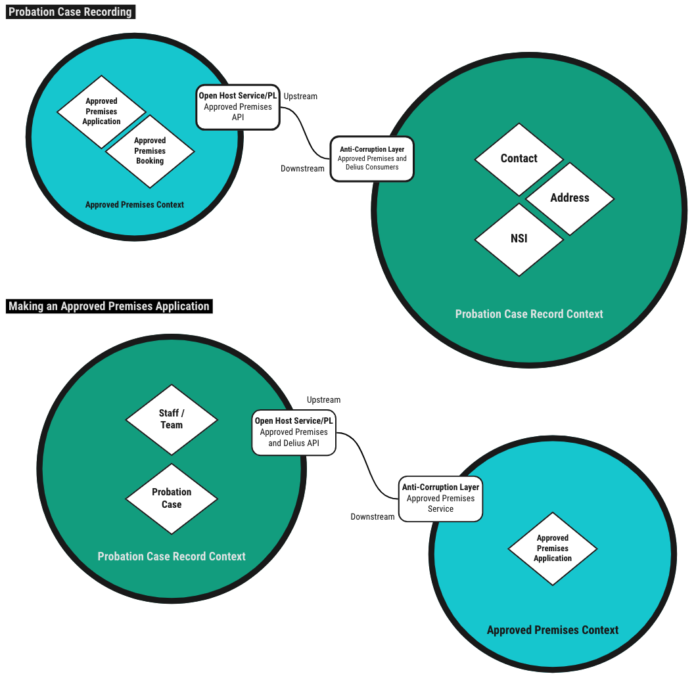

# Approved Premises and Delius

Service that responds to Approved Premises domain events, calls the
[HMPPS Approved Premises API](https://github.com/ministryofjustice/hmpps-approved-premises-api)
and records referral progress against the probation case record in Delius. We
also provide an API to give probation case information to support making
approved premises referrals.

## Business Need

Supporting the Approved Premises service with the correct information required
to make an Approved Premises application and ensuring the Probation
Practitioner has an up-to-date view of activity in the Approved Premises
service when interacting with the probation case via Delius.

## Context Maps

## Interfaces

### Message Formats

The service responds to various HMPPS Domain Event message via the
[Approved Premises and Delius Queue](https://github.com/ministryofjustice/cloud-platform-environments/blob/main/namespaces/live.cloud-platform.service.justice.gov.uk/hmpps-probation-integration-services-prod/resources/approved-premises-and-delius-queue.tf).
The events are raised by the [HMPPS Approved Premises Service](https://github.com/ministryofjustice/hmpps-approved-premises-api)
to communicate important events in the approved premises referrals process.

Example [messages](./src/dev/resources/messages/) are in the development source tree.

Incoming messages are filtered on `eventType` by the [SQS queue policy](https://github.com/ministryofjustice/cloud-platform-environments/blob/cc44e15d883b04d1caf5663eec6025674dc10eb5/namespaces/live.cloud-platform.service.justice.gov.uk/hmpps-probation-integration-services-prod/resources/approved-premises-and-delius-queue.tf#L5-L14)

## Event Triggers

Approved Premises domain events are raised in real time as approved premises
referrals are processed. The progressive stages of a referral are raised as
separate events

| Business Event                                        | Message Class      | Message Event Type / Filter               |
|-------------------------------------------------------|--------------------|-------------------------------------------|
| A referral to an approved premises has been assessed  | HMPPS Domain Event | "approved-premises.application.assessed"  |
| A referral to an approved premises has been submitted | HMPPS Domain Event | "approved-premises.application.submitted" |
