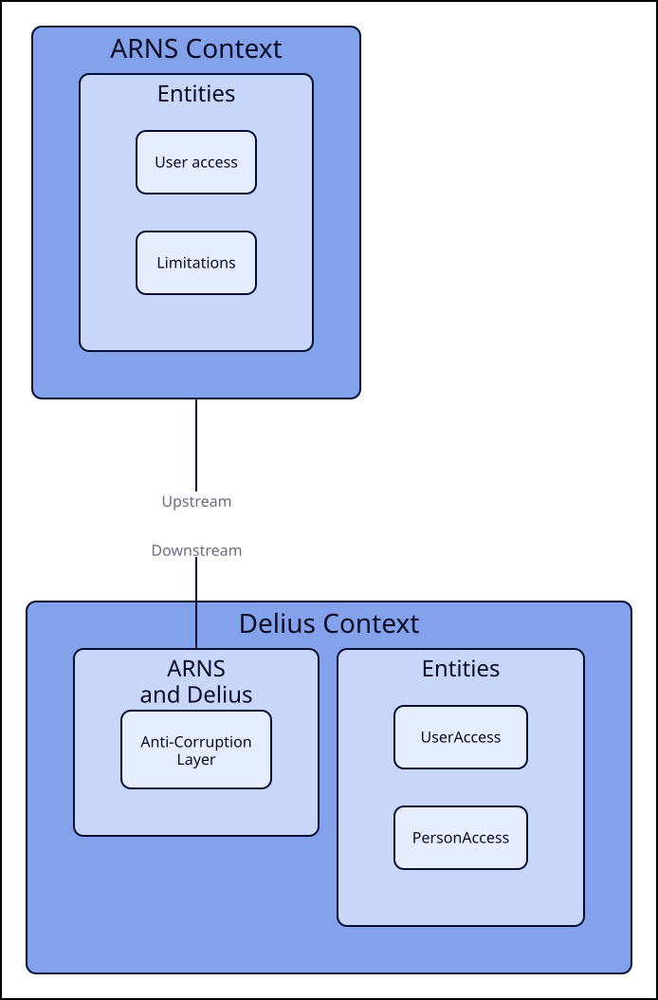

# ARNS and Delius

This integration service provides APIs to:
- get the limitations (exclusions and restrictions) for a user
- get case data for a CRN (date of birth, gender, main offence, start date, conviction date)

## Business need

To allow the Assess Risks and Needs (ARNS) service to prevent unauthorised access to a probation case.

## Data dependencies
This depends on Delius for up-to-date information on the restrictions and exclusions applied to a user.

### Context Map

## API Access Control

API endpoints are secured by roles supplied by the HMPPS Auth client used in
the requests

| API Endpoint  | Required Role                      |
|---------------|------------------------------------|
| /users/access | PROBATION_API__ARNS__USER_ACCESS |
| /arns/{crn}   | PROBATION_API__ARNS__CASE_DETAIL |
