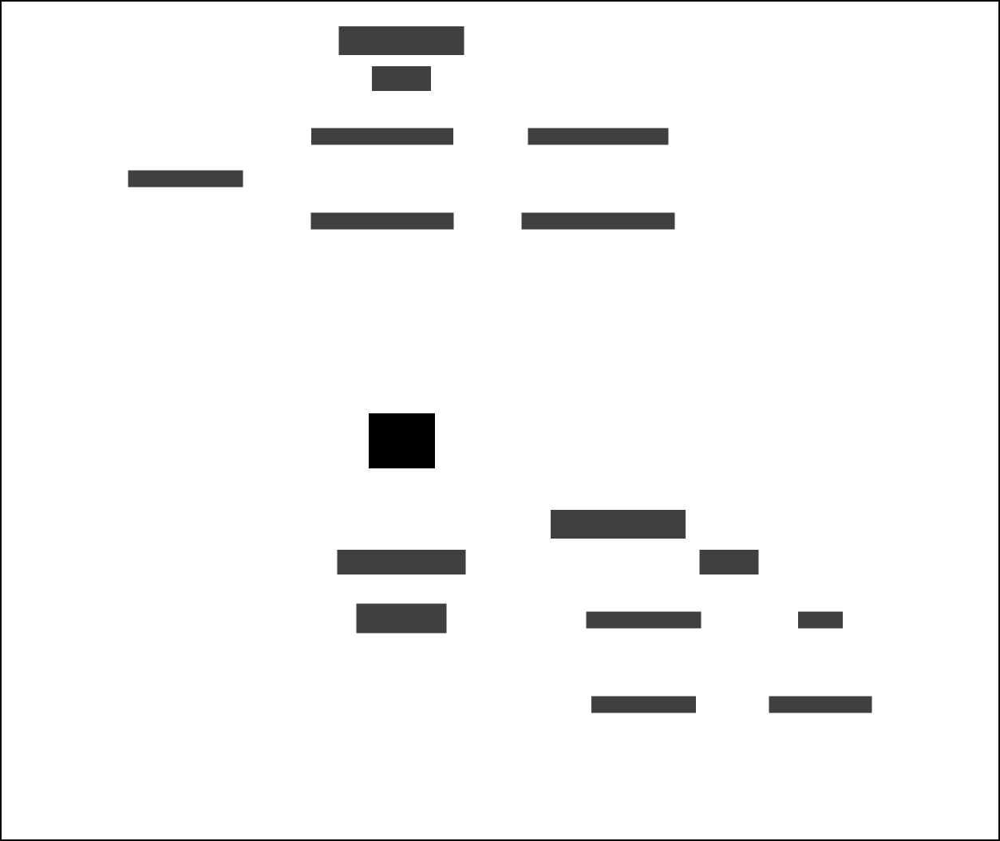

# CAS3 and Delius

Service that responds to Community Accommodation Services Tier 3 (CAS3) domain events. The service is responsible for updating Delius with progress of referrals to transitional accommodation for people released from custody without a home.

## Business Need

Ensuring the Probation Practitioner has an up-to-date view of activity in the CAS3 service when interacting with the probation case via Delius.

## Context Map

## Workflows

CAS3 domain events are raised in real time as transitional accommodation referral applications, bookings and residencies are processed in the CAS3 application.

### Transitional Accommodation Referral Application

A referral application is created in the CAS3 service which is reflected in a Delius contact. An `EXTERNAL_REFERENCE` URN is added to the contact in the form `urn:hmpps:cas3:application-submitted:{applicationId}` using the CAS3 application ID as a unique reference.

| Business Event                                                    | Message Event Type / Filter                   |
|-------------------------------------------------------------------|-----------------------------------------------|
| Submission of a accommodation referral application                | accommodation.cas3.referral.submitted         |

### Transitional Accommodation Booking

Accommodation booking activity in the CAS3 service is reflected in a set of Delius contacts representing the progress of the booking. An `EXTERNAL_REFERENCE` URN is added to the contact in the form `urn:hmpps:cas3:booking-{action}:{referralId}` using the CAS3 booking ID as a unique reference. Domain events indicating an update to a particular booking activity will find and update the relevant contact identified by the external reference URN.

| Business Event                                                    | Message Event Type / Filter                   |
|-------------------------------------------------------------------|-----------------------------------------------|
| Creation of a provisional accommodation booking                   | accommodation.cas3.booking.provisionally-made |
| Confirmation of an accommodation booking                          | accommodation.cas3.booking.confirmed          |
| Cancellation of an accommodation booking                          | accommodation.cas3.booking.cancelled          |

### Transitional Accommodation Booking Update

Updates to accommodation bookings in the CAS3 service are reflected in the Delius contacts previously created to represent the activity. Upon receiving an update event the integration service will find and update the relevant contact identified by the external reference URN.

| Business Event                                                    | Message Event Type / Filter                   |
|-------------------------------------------------------------------|-----------------------------------------------|
| An update to the details of an accommodation booking cancellation | accommodation.cas3.booking.cancelled.updated  |

### Transitional Accommodation Residence

The CAS3 application will raise domain events with details of arrivals and departures from transitional accommodation premises. An `EXTERNAL_REFERENCE` URN is added to the contact in the form `urn:hmpps:cas3:person-{action}:{referralId}` using the CAS3 booking ID as a unique reference. The person's main address is updated to reflect their movement into or out of transitional accommodation.

| Business Event                                      | Message Event Type / Filter                |
|-----------------------------------------------------|--------------------------------------------|
| Arrival at transitional accommodation                  | accommodation.cas3.person.arrived          |
| Departure from transitional accommodation              | accommodation.cas3.person.departed         |

### Transitional Accommodation Residence Update

The CAS3 application will raise domain events when details of arrivals and departures from transitional accommodation premises are changed. Upon receiving an update event the integration service will find and update the relevant contact identified by the external reference URN.

| Business Event                                      | Message Event Type / Filter                |
|-----------------------------------------------------|--------------------------------------------|
| Update to transitional accommodation arrival details   | accommodation.cas3.person.arrived.updated  |
| Update to transitional accommodation departure details | accommodation.cas3.person.departed.updated |

## Interfaces

### Message Interface

The service responds to HMPPS Domain Event messages via the
[Queue](https://github.com/ministryofjustice/cloud-platform-environments/blob/main/namespaces/live.cloud-platform.service.justice.gov.uk/hmpps-probation-integration-services-prod/resources/cas3-and-delius-queue.tf).
The events are raised by the [HMPPS Approved Premises API](https://github.com/ministryofjustice/hmpps-approved-premises-api/) which handles backend integration for the [CAS3 UI](https://github.com/ministryofjustice/hmpps-temporary-accommodation-ui/)

Example [messages](./src/dev/resources/messages/) are in the development source tree.

Incoming messages are filtered on `eventType` by the [SQS queue policy](
https://github.com/ministryofjustice/cloud-platform-environments/blob/be6588c3e9cfdd4f3e7cfb4c96ddb38591075c8d/namespaces/live.cloud-platform.service.justice.gov.uk/hmpps-probation-integration-services-prod/resources/cas3-and-delius-queue.tf#L5-L17)
