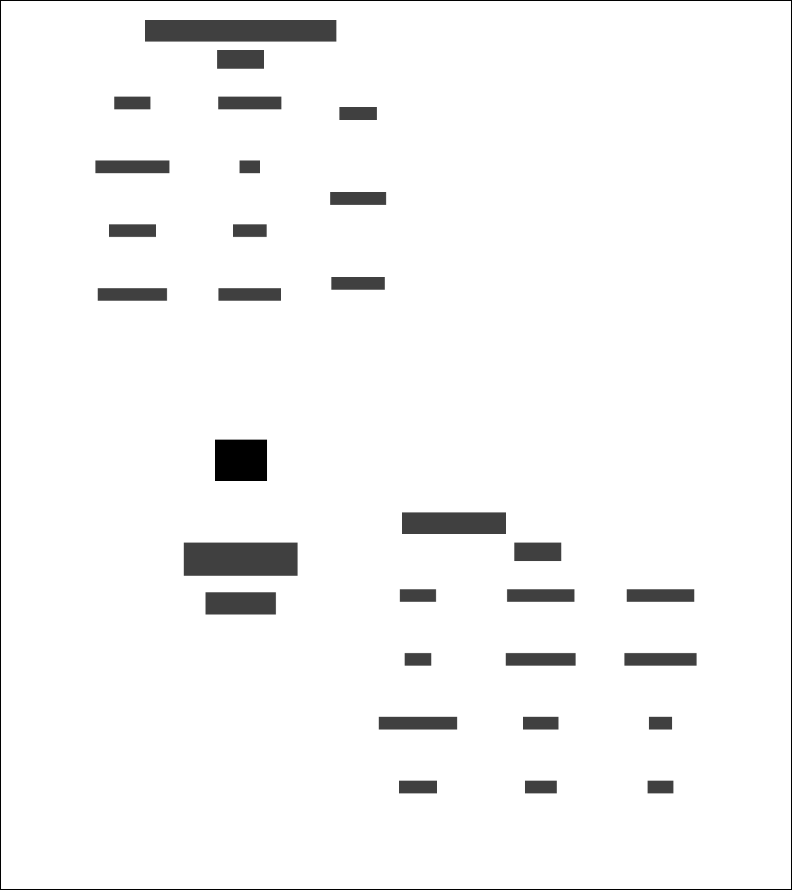

# Common platform and Delius

This service listens to domain events when a new Court hearing has been published.

## Data dependencies

This service depends on:

* Delius to store the data for the defendant
* Search index to store the Court messages
* HMPPS Core Person Record to check if the defendant is already known

### Context Map - Common Platform Data

## Workflows

### Hearing received
Store the Court messages in a format optimised for searching. Filter on defendants that are "Remanded in custody" and store if they are not known to the service. The defendant must meet a minimum age.

### Store person on remand
Store the person and event in Delius then raise notifications for the creation of the case and person address.

## Interfaces

### Message formats

The service responds to HMPPS Domain Event messages via the [Common Platform and Delius Queue](https://github.com/ministryofjustice/cloud-platform-environments/blob/main/namespaces/live.cloud-platform.service.justice.gov.uk/hmpps-probation-integration-services-prod/resources/common-platform-and-delius-queue.tf).

Example [messages](./src/dev/resources/messages/) are in the development source tree.

Incoming messages are filtered on `eventType` by the [SQS queue policy](https://github.com/ministryofjustice/cloud-platform-environments/blob/main/namespaces/live.cloud-platform.service.justice.gov.uk/hmpps-probation-integration-services-prod/resources/common-platform-and-delius-queue.tf)