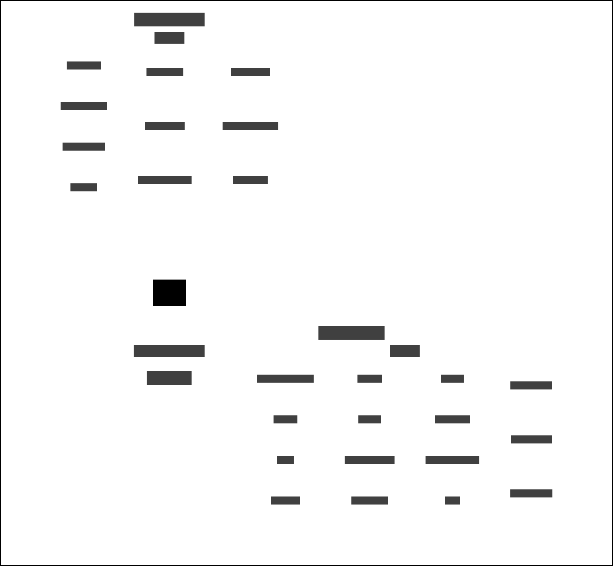

# Community Order and Suspended Sentence Order (COSSO) and Delius

The [HMPPS COSSO Breach Report service](https://github.com/ministryofjustice/hmpps-breach-report-co-sso-ui) enables
probation practitioners to create breach notice letters for offenders who have failed to comply with the requirements of
their community order or suspended sentence order.

## Business Need

This integration service provides an API for read-only access to case data from Delius, to reduce the need for re-keying
in the Breach Notice service.

It also accepts inbound events when a breach notice is created or deleted, to copy a snapshot of the document into
Delius and Alfresco.

## Context Map

## Interfaces

### Message Formats

The service responds to HMPPS Offender Event messages via an
[SQS Queue](https://github.com/ministryofjustice/cloud-platform-environments/blob/main/namespaces/live.cloud-platform.service.justice.gov.uk/hmpps-probation-integration-services-prod/resources/breach-notice-and-delius-queue.tf).

Example [messages](./src/dev/resources/messages/) are in the development source tree

## Event Triggers

| Business Event                | Message Event Type / Filter                |
|-------------------------------|--------------------------------------------|
| COSSO breach notice completed | probation-case.cosso-breach-notice.created |
| COSSO breach notice deleted   | probation-case.cosso-breach-notice.deleted |
