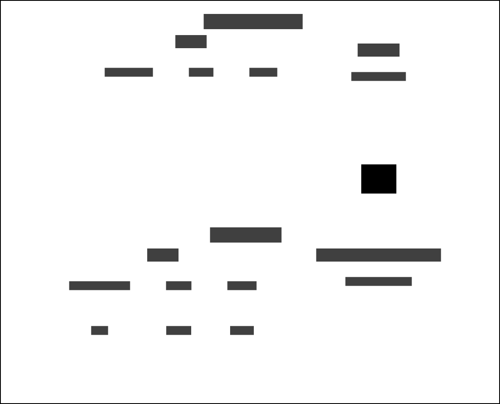

# Custody Key Dates and Delius

## Business Need

Inbound service that keeps Delius updated with key date changes recorded in custody services, primarily NOMIS.

## Context Map

## Interfaces

The service responds to HMPPS Offender Event messages via an
[SQS Queue](https://github.com/ministryofjustice/cloud-platform-environments/blob/main/namespaces/live.cloud-platform.service.justice.gov.uk/hmpps-probation-integration-services-prod/resources/custody-key-dates-and-delius-queue.tf).

Example [messages](./src/dev/resources/messages/) are in the development source tree

## Event Triggers

| Business Event                         | Message Class  | Message Event Type / Filter    |
|----------------------------------------|----------------|--------------------------------|
| Release date changed in NOMIS/DPS      | Offender Event | CONFIRMED_RELEASE_DATE-CHANGED |
| Sentence dates changed in NOMIS/DPS    | Offender Event | SENTENCE_DATES-CHANGED         |
| General key date change in NOMIS/DPS   | Offender Event | KEY_DATE_ADJUSTMENT_UPSERTED   |
| General key date deletion in NOMIS/DPS | Offender Event | KEY_DATE_ADJUSTMENT_DELETED    |

## Workflows

### Update Key Dates

## Custody Key Dates Recorded in Delius

Prison API provides a set of dates recorded in NOMIS that are recorded in the Throughcare section of Delius when the key dates updates are triggered. The dates are displayed in the 'Throughcare Dates' and 'Additional Throughcare Dates' section of the 'Throughcare Details' screen, which is accessed via the Delius Event. All dates that do not match the existing Delius values will be updated on receiving an event trigger. The custody dates obtained via Prison API are:

- Sentence Expiry Date
- Licence Expiry Date
- Conditional Release Date / Override Date
- Expected Release Date
- Home Detention Curfew Eligibility Date
- Post Sentence Supervision End Date
