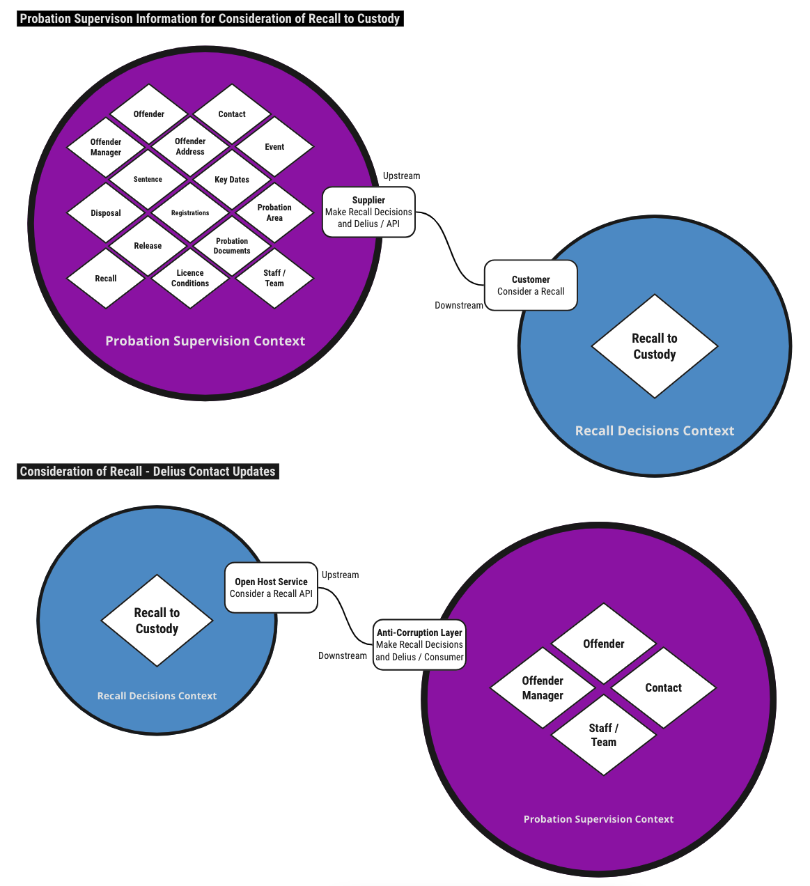

# Make Recall Decisions and Delius

## Business Need

Supports integration between the
[Consider a Recall](https://github.com/ministryofjustice/make-recall-decision-api)
(previously Make a Recall Decision) service and
[Delius](https://github.com/ministryofjustice/delius). The service
provides an API for gathering data on the person on probation and the
probation case history, including case documents. The service also listens for
events produced by the Consider a Recall service in order to reflect the
activity around recall decisions in the Delius contact history.

## Context Maps

## Interfaces

### Message Formats

The service raises HMPPS Domain Event messages to the
[HMPPS Domain Events Topic](https://github.com/ministryofjustice/cloud-platform-environments/blob/main/namespaces/live.cloud-platform.service.justice.gov.uk/hmpps-domain-events-prod/resources/hmpps-domain-events-topic.tf).
The events are raised by the [HMPPS Consider a Recall Service](https://github.com/ministryofjustice/make-recall-decision-api)
indicating significant events in the 'recall to custody' decision process

Example [messages](https://github.com/ministryofjustice/hmpps-probation-integration-services/tree/main/projects/make-recall-decisions-and-delius/src/dev/resources/messages/) are in the development source tree.

Incoming messages are filtered on `eventType` by the [SQS queue policy](https://github.com/ministryofjustice/cloud-platform-environments/blob/02fd1494435dd2525f2820f447ea7cdc10ddf54d/namespaces/live.cloud-platform.service.justice.gov.uk/hmpps-probation-integration-services-prod/resources/make-recall-decisions-and-delius-queue.tf#L5-L10)

## Event Triggers

Allocation domain events are raised in real time as probation cases are
allocated to a practitioner. The individual elements of the case are raised as
separate events.

| Business Event                    | Message Class      | Message Event Type / Filter                         |
|-----------------------------------|--------------------|-----------------------------------------------------|
| Recall being considered           | HMPPS Domain Event | "prison-recall.recommendation.consideration"        |
| Recall decision has been made     | HMPPS Domain Event | "prison-recall.recommendation.management-oversight" |
| Recommendation deleted or expired | HMPPS Domain Event | "prison-recall.recommendation.deleted"              |

For more details of asynchronous events used by this service, see
the [AsyncAPI Reference](https://ministryofjustice.github.io/hmpps-probation-integration-services/tech-docs/projects/make-recall-decisions-and-delius/asyncapi-reference.html)

## Authorisation

API endpoints are secured by roles supplied by the HMPPS Auth client used in
the requests

| API Endpoint | Required Role                      |
|--------------|------------------------------------|
| All          | ROLE\_MAKE\_RECALL\_DECISIONS\_API |
