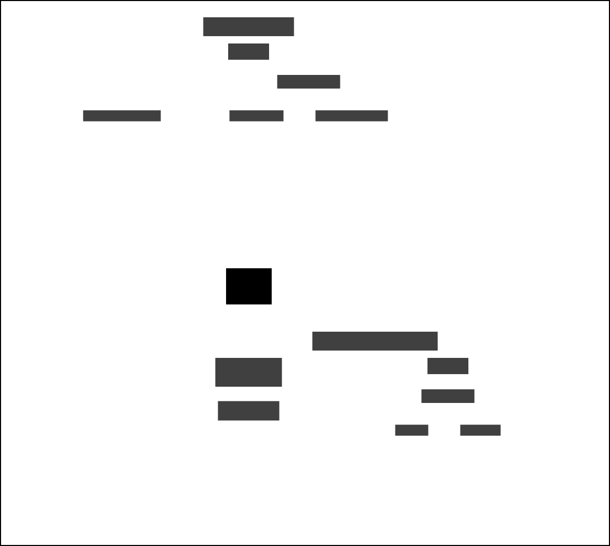

# Offender Events and Delius

Outbound Service that sends data events based on changes in the National Delius database. Changes are detected by
polling the OFFENDER_DELTA table, which is populated by database triggers on the relevant tables.

The supported data events are:

| Message event type                 | Description                                                                           |
|------------------------------------|---------------------------------------------------------------------------------------|
| CONTACT_CHANGED                    | An insert or update to the CONTACT table                                              | 
| CONTACT_DELETED                    | A deletion from the CONTACT table                                                     | 
| CONVICTION_CHANGED                 | A change to the EVENT table                                                           | 
| COURT_APPEARANCE_CHANGED           | A change to the COURT_APPEARANCE table                                                | 
| OFFENDER_ADDRESS_CHANGED           | A change to the OFFENDER_ADDRESS table                                                | 
| OFFENDER_ALIAS_CHANGED             | A change to the ALIAS table                                                           | 
| OFFENDER_CHANGED                   | A change to the ALIAS, OFFENDER, OFFENDER_MANAGER, OFFENDER_ADDRESS or OFFICER tables | 
| OFFENDER_DETAILS_CHANGED           | A change to the OFFENDER table                                                        | 
| OFFENDER_MANAGER_CHANGED           | A change to the OFFENDER_MANAGER table                                                | 
| OFFENDER_OFFICER_CHANGED           | A change to the OFFICER table                                                         | 
| OFFENDER_OGRS_ASSESSMENT_CHANGED   | A change to the OGRS_ASSESSMENT table                                                 | 
| OFFENDER_REGISTRATION_CHANGED      | An insert or update to the REGISTRATION table                                         | 
| OFFENDER_REGISTRATION_DELETED      | A deletion from the REGISTRATION table                                                | 
| OFFENDER_REGISTRATION_DEREGISTERED | A change to the DEREGISTRATION table                                                  | 
| ORDER_MANAGER_CHANGED              | A change to the ORDER_MANAGER table                                                   | 
| SENTENCE_CHANGED                   | A change to the DISPOSAL table                                                        | 
| SENTENCE_ORDER_REQUIREMENT_CHANGED | A change to the RQMNT table                                                           | 

See [OffenderDeltaPoller.kt](./src/main/kotlin/uk/gov/justice/digital/hmpps/integrations/delius/OffenderDeltaPoller.kt)
for the up-to-date mapping.

## Data dependencies

Delius for retrieving batches of changes waiting to be processed.

### Context map - Domain Event Data



## Development

By default, offender-events will use the internal queue to send messages for development.
This means just starting the application using the dev class path is sufficient to run the database (H2) and outbound
message queue.

### Using LocalStack

If desired, the app can be connected to a localstack instance to reflect the AWS SNS topic.

Use the docker-compose file provided with the project to start up localstack services in a container

```shell
docker-compose up -d
```

For the following connect to the shell of the container

```shell
docker exec -it localstack /bin/bash
```

It will be necessary to configure the aws cli before use. The values are not validated so any access key id or access
secret can be used.

```shell
aws configure
```

#### Create the topic:

```shell
aws --endpoint-url=http://localhost:4566 sns create-topic --name offender-events --region eu-west-2
```

#### Create a queue:

```shell
aws --endpoint-url=http://localhost:4566 sqs create-queue --queue-name offender-events --region eu-west-2
```

#### Subscribe the queue to the topic to receive messages published to the topic:

```shell
aws --endpoint-url=http://localhost:4566 sns subscribe \
--topic-arn arn:aws:sns:eu-west-2:000000000000:offender-events \
--protocol sqs \
--notification-endpoint http://localhost:4566/000000000000/offender-events
```

#### Check for messages

```shell
aws --endpoint-url=http://localhost:4566 sqs receive-message \
--queue-url http://localhost:4566/000000000000/offender-events \
--max-number-of-messages 10
```

Add the following environment variables before running the application:

```shell
MESSAGING_PRODUCER_TOPIC=arn:aws:sns:eu-west-2:000000000000:offender-events
CLOUD_AWS_SQS_REGION=eu-west-2 # for localstack only - not required in AWS
CLOUD_AWS_SQS_ENDPOINT=http://localhost:4566 # for localstack only - not required in AWS
```