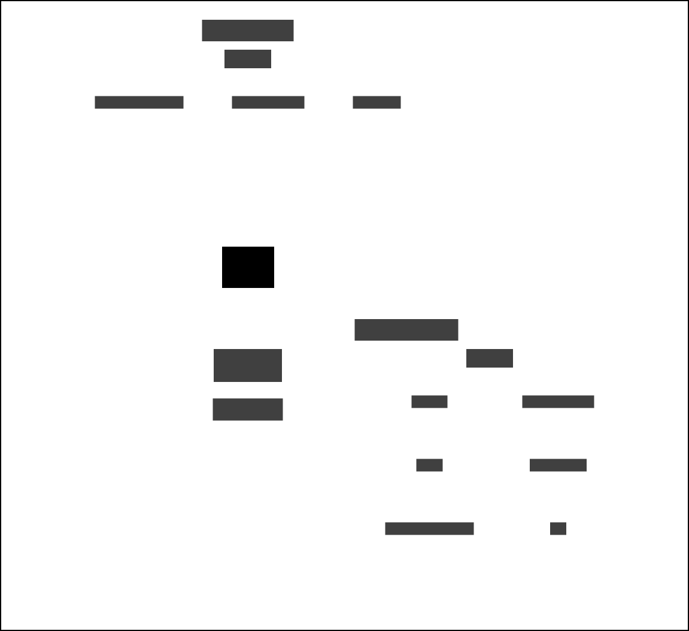

# OPD and Delius

This service listens to domain events when a new Offender Personality Disorder (OPD) assessment has been produced in OAsys.

A new assessment will contain one of the following results:

* Screened in
* Screened in - with override
* Screened out

Notes from screened in OPD assessments are stored. Screened out OPD assessments are ignored.

## Business need
This will provide a quick overview of the person on probation and their needs in Delius to reduce the need for users to navigate around multiple systems.

## Data dependencies
When a domain event is received from the OPD assessment service, if the OPD assessment result is screened in, the notes in the OPD assessment are appended to the existing notes in an NSI record in Delius. If an NSI record does not exist for the OPD assessment, a new one is created.

### Context Map

## Workflows

### OPD workflow
The OPD assessment notes are appended to the NSI OPD assessment record for screened in OPD assessments.

| Business Event            | Message Attribute Event Type      | Message Event Type |
| ------------------------- | --------------------------------- | ------------------ |
| OPD assessment submitted  | risk-assessment.scores.determined | opd.produced       |

## Interfaces

### Message formats

The service responds to HMPPS Domain Event messages via the [OPD and Delius Queue](https://github.com/ministryofjustice/cloud-platform-environments/blob/main/namespaces/live.cloud-platform.service.justice.gov.uk/hmpps-probation-integration-services-prod/resources/opd-and-delius-queue.tf).

Example [messages](./src/dev/resources/messages/) are in the development source tree.

Incoming messages are filtered on `eventType` by the [SQS queue policy](https://github.com/ministryofjustice/cloud-platform-environments/blob/main/namespaces/live.cloud-platform.service.justice.gov.uk/hmpps-probation-integration-services-prod/resources/opd-and-delius-queue.tf)