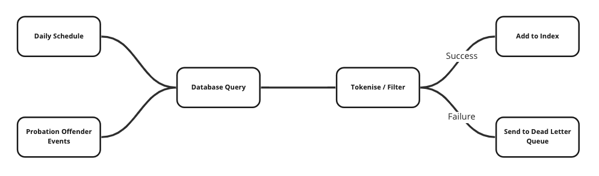

# Person Search Index From Delius

Outbound service that sends details of people on probation held in the Delius
database to an indexing process. The resulting index supports searching and
matching details of people on probation and makes up the core of the
[Probation Offender Search](https://github.com/ministryofjustice/probation-offender-search)
service. The service is based on an instance of [Logstash](https://www.elastic.co/logstash/)

## HMPPS Business Need

Searching and matching records held on people on probation is needed by
multiple systems within HMPPS. This service provides full and incremental
indexing to ensure that we provide search and match capability for people on
probation using an up-to-date dataset. The index is refreshed on a
[daily schedule](https://github.com/ministryofjustice/hmpps-probation-integration-services/blob/main/projects/person-search-index-from-delius/deploy/values-prod.yml#L5)
and incrementally updated during the working day based on Delius data events.

## HMPPS Domain Mapping

The person search index contains the elements of **Core Person Record** that
are currently stored in the Delius database. This includes information on
their relationship with the probation service (**Person OMiC/POM/COM**), the
**Person Location** and overview data on the person's **Sentence/Offence**

## Context Map / Interfaces

The service takes data from the Delius database and converts to the document
format that forms the 'offender' response of both [Probation Offender Search](https://github.com/ministryofjustice/probation-offender-search)
and [Community API](https://github.com/ministryofjustice/community-api). This
document format is the de-facto representation of the person on probation as
used by HMPPS Digital services. The data format can be seen in the response
definitions of [Probation Offender Search](https://probation-offender-search-dev.hmpps.service.justice.gov.uk/swagger-ui/index.html#/offender-search/search)

The mappings between the indexed document data format and the Delius database
fields are within the [Delius database query](https://github.com/ministryofjustice/hmpps-probation-integration-services/blob/f014e0319e67859182415bd7cecfd948e8d76135/projects/person-search-index-from-delius/container/statement.sql)
that forms the core of the indexing process.

The search and match functionality of Probation Offender Search is determined
by the [index template](https://github.com/ministryofjustice/hmpps-probation-integration-services/blob/main/projects/person-search-index-from-delius/container/management/person-search-template.json)
and the [indexing pipeline](https://github.com/ministryofjustice/hmpps-probation-integration-services/blob/main/projects/person-search-index-from-delius/container/management/person-search-pipeline.json)
which together define the pre-processing and field analysis that result in a
searchable index.

## Processing Pipeline

## Downstream Business Functionality

- Search of people on probation in HMPPS Digital services including NDelius
- Matching of people within HMPPS Digital services
- Matching of people to determine links between prison and probation systems

## Relevant HMPPS Domain/Data Events

Incremental indexing is supported by [Probation Data Events](https://github.com/ministryofjustice/hmpps-probation-integration-services/blob/main/projects/offender-events-and-delius/README.md)
