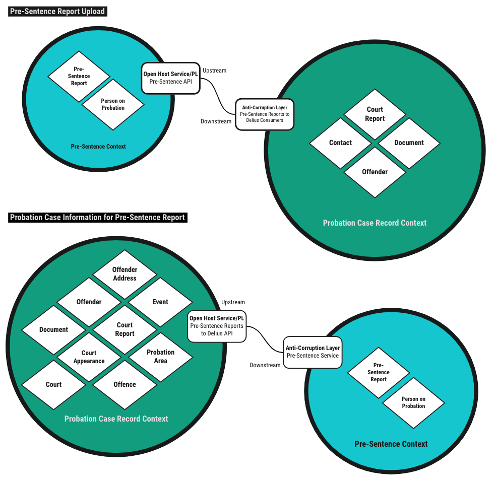

# Pre-Sentence Reports to Delius

Service that supports integration between the [Pre-Sentence Service](https://github.com/ministryofjustice/pre-sentence-service)
and [Delius](https://github.com/ministryofjustice/delius). The workflow for a
pre-sentence report involves initiating a report in Delius, completing the
report in the Pre-Sentence Service and uploading the completed report to
Delius and Alfresco. The integration service enables the Pre-Sentence Service
to gather probation case information to be used in the document creation
workflow and also enables asynchronous upload of the final document to the
probation case record when the Pre-Sentence Service workflow is complete.

## Business Need

Supporting the Pre-Sentence Service with probation case information, ensuring
this cross-system workflow requires minimal double-keying. Automatically
uploading the completed document to the correct location in the Delius case
record, removing a manual step from the overall process.

## Context Maps

