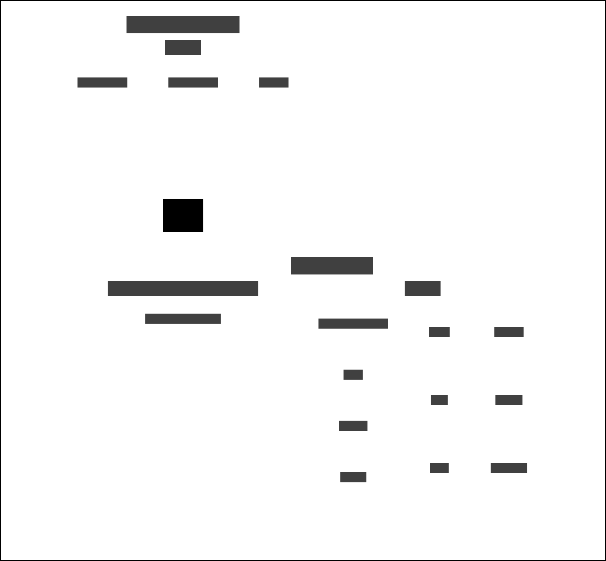

# Prison Custody Status to Delius

Inbound service that responds to events raised when the custody status of a
person in prison changes. The service is notified when a person is released
from prison or a person is recalled to prison. The information about the
specific type of custody status is contained in the notification message.
Thisa is used to add and update **Custody** records in Delius to ensure the
correct case history is maintained and the person's current location is
accurately recorded. We also create any necessary **Contacts**, terminate
**Licence Conditions** as needed. The necessary audit logs and IAPS events are
also added

## Business Need

Removes the need for Probation Practitioners to manually update Delius with
the custody status of a person as they move in and out of prison.

## Data Dependencies

_Delius_ depends on _NOMIS_ to inform when a **Person on Probation** has been released from custody. To do this the
_Delius_ record must have been previously matched with a _NOMIS_ record and the **NOMS Number** must have been added to
the _Delius_ record. The custody status processing may depend on the _NOMIS_ **Movement Reason Code** to determine the type of release. The _NOMIS_ **Institution** that the person is leaving is added to the _Delius_ **Release** record based on the
_NOMIS_ **Institution CDE Code**. If the message also contains an **Institution CDE Code** for the institution that the person
is being released to, as in the case of a release to a secure hospital or IRC, then this will be used to update the person's current location.

### Context Map

## Workflows

_Delius_ custody status workflows are triggered in real time by notification messages from _NOMIS_

### Release from Custody

Custody release messages are processed when a person's release is recorded in _NOMIS_

| Business Event       | Event Type / Filter                      |
|----------------------|------------------------------------------|
| Release from Custody | prison-offender-events.prisoner.released |

### Recall to Custody

Custody received messages are processed when a person's arrival at a custody location is recorded in _NOMIS_

| Business Event    | Event Type / Filter                      |
|-------------------|------------------------------------------|
| Recall to Custody | prison-offender-events.prisoner.received |

## Interfaces

### Message Formats

The service responds to HMPPS Domain Event messages via the
[HMPPS Prison Custody Status to Delius Queue](https://github.com/ministryofjustice/cloud-platform-environments/blob/main/namespaces/live.cloud-platform.service.justice.gov.uk/hmpps-domain-events-prod/resources/hmpps-prison-custody-status-to-delius-queue.tf)
The events are raised by the [Prison Offender Events](https://github.com/ministryofjustice/prison-offender-events/) service,
which responds to changes made in the NOMIS database.

Example [messages](./src/dev/resources/messages/) are in the development source tree.

Incoming messages are filtered on the `eventType` attribute by the [SQS queue policy](https://github.com/ministryofjustice/cloud-platform-environments/blob/main/namespaces/live.cloud-platform.service.justice.gov.uk/hmpps-domain-events-prod/resources/hmpps-prison-custody-status-to-delius-queue.tf#L6-L10).

### Custody Status Details

As we are not able to process all types of custody activity we use the details
in the  `additionalInformation` field to determine whether the specific
notification is suitable to be ingested into Delius. Currently we are able to
process the following custody change types:

| Custody Change | Type                                        | Reason Code                |
|----------------|---------------------------------------------|----------------------------|
| Release        | Released on Adult Licence / Secure Hospital | RELEASED                   |
| Release        | Released to a Secure Hospital               | RELEASED\_TO\_HOSPITAL     |
| Recall         | Recall to Custodial Establishment           | ADMISSION                  |
| Recall         | Recall - End of Temporary Licence           | TEMPORARY\_ABSENCE\_RETURN |
| Recall         | Transfer from Other Establishment           | TRANSFERRED                |

## End-to-End Test

The service is [end-to-end tested](https://github.com/ministryofjustice/hmpps-probation-integration-e2e-tests/tree/main/tests/prison-custody-status-to-delius)
using a combination of [Prison API](https://github.com/ministryofjustice/prison-api) calls and Delius UI inspection.
