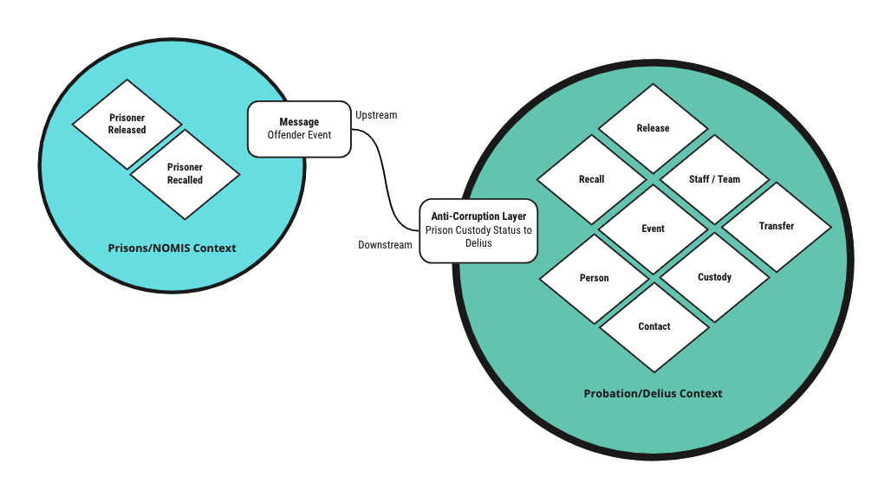

# Prison Custody Status to Delius

Inbound service that responds to events raised when the custody status of a
person in prison changes. The service is notified when a person is released
from prison or a person is recalled to prison. The information about the
specific type of custody status is contained in the notification message. This
is used to add and update `Custody` and `Event` records in Delius to ensure
the correct case history is maintained and the person's current location is
accurately recorded. We also create any necessary `Contact`s, terminate
`LicenceCondition`s and allocate the person to a `ResponsibleOfficer` as
needed. We also add the necessary audit logs and IAPS events.

## Probation Business Need

Removing the need for Probation Practitioners to manually update Delius with
the custody status of a person as they move in and out of prison.

## Context Map

## Interfaces

### Message Formats

The service responds to HMPPS Domain Event messages via the
[HMPPS Prison Custody Status to Delius Queue](https://github.com/ministryofjustice/cloud-platform-environments/blob/main/namespaces/live.cloud-platform.service.justice.gov.uk/hmpps-domain-events-prod/resources/hmpps-prison-custody-status-to-delius-queue.tf)
The events are raised by the [Prison Offender Events](https://github.com/ministryofjustice/prison-offender-events/) service,
which responds to changes made in the NOMIS database.

Example [messages](./src/dev/resources/messages/) are in the development source tree.

Incoming messages are filtered on the `eventType` attribute by the [SQS queue policy](https://github.com/ministryofjustice/cloud-platform-environments/blob/main/namespaces/live.cloud-platform.service.justice.gov.uk/hmpps-domain-events-prod/resources/hmpps-prison-custody-status-to-delius-queue.tf#L6-L10).

## Event Triggers

| Business Event      | Message Class      | Message Event Type / Filter              |
|---------------------|--------------------|------------------------------------------|
| Release from Prison | HMPPS Domain Event | prison-offender-events.prisoner.released |
| Recall to Prison    | HMPPS Domain Event | prison-offender-events.prisoner.received |

### Custody Status Details

As we are not able to process all types of custody activity we use the details
in the  `additionalInformation` field to determine whether the specific
notification is suitable to be ingested into Delius. Currently we are able to
process the following custody change types:

| Custody Change | Type                                       | Reason Code |
|----------------|--------------------------------------------|-------------|
| Release        | Released on Adult Licence                  | RELEASED    |
| Recall         | Recall Notified by Custodial Establishment | ADMISSION   |

## End-to-End Test

The service is [end-to-end tested](https://github.com/ministryofjustice/hmpps-probation-integration-e2e-tests/tree/main/tests/prison-custody-status-to-delius)
using a combination of [Prison API](https://github.com/ministryofjustice/prison-api) calls and Delius UI inspection.
