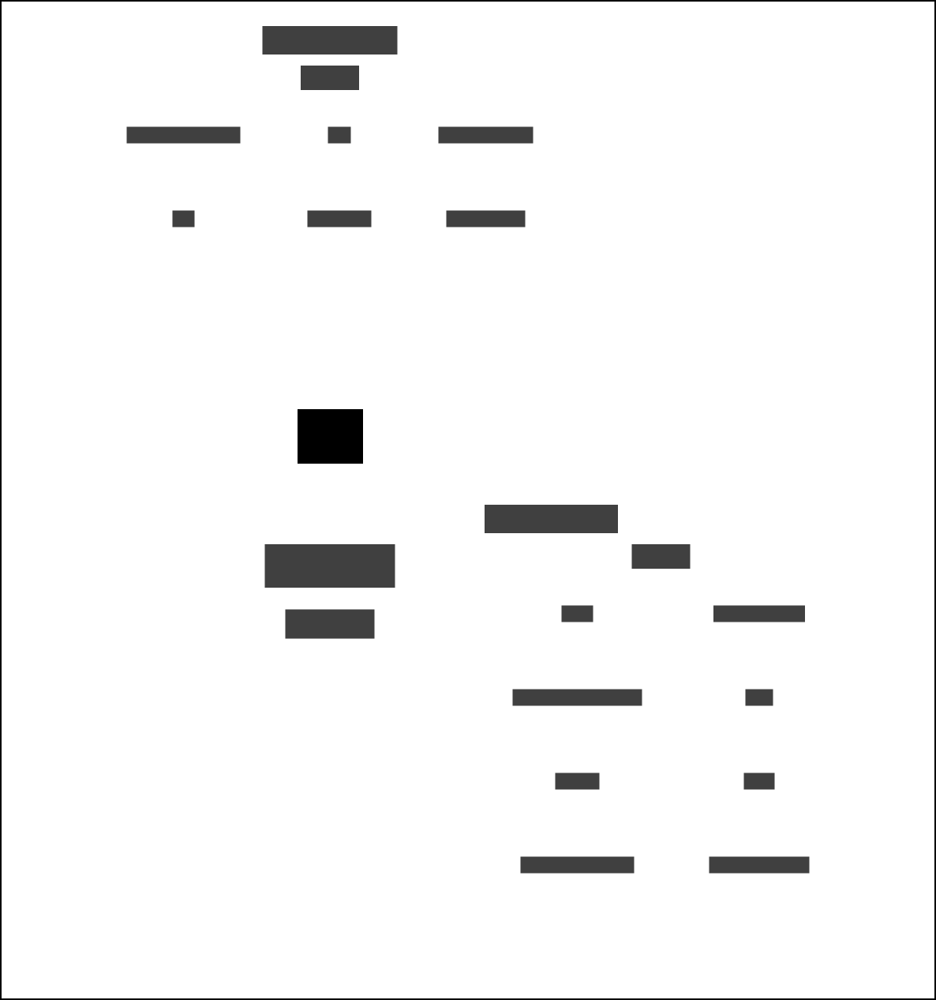

# Risk Assessment Scores to Delius

Updates risk assessment scores in Delius following assessments in the OASys Offender Assessment system.

This integration service listens for domain events generated by OASys and updates Delius with changes to the following
risk scores:

* Risk of serious recidivism (RSR)
* OASys sexual reoffending predictor (OSP)
* Offender group reconviction scale (OGRS)

The scores are updated when an OASys risk assessment is submitted for a **Person on Probation**.

## Business need
Helps the business users understand the actuarial risk predictors within the Delius user interface.

## Data dependencies
This integration service is used to update the RSR and OSP risk scores in Delius. The service will also add/update scores from OGRS risk assessments for a **Person on Probation** and an **Event** in Delius.

### Context map - Risk Assessment Data



## Workflows

| Business Event      | Message Event Type/Filter              |
| ------------------- | -------------------------------------- |
| Risk scores updated | risk-assessment.scores.rsr.determined  |
| Risk assessment     | risk-assessment.scores.ogrs.determined |

### Risk Score Workflow
Two types of scores are provided in the risk score data: risk of serious recidivism (RAR) and OASys sexual reoffending predictor (OSP). The scores are updated in Delius.


### OGRS Risk Assessment Workflow
An OGRS risk assessment is conducted for a **Person on Probation** for a specific **Event**. The offender group reconviction scale (OGRS) score is stored or updated in Delius when the risk assessment is submitted.


## Interfaces

### Message Formats

The service responds to HMPPS Domain Event messages via the
[Risk Assessment Scores and Delius Queue](https://github.com/ministryofjustice/cloud-platform-environments/blob/main/namespaces/live.cloud-platform.service.justice.gov.uk/hmpps-probation-integration-services-prod/resources/risk-assessment-scores-to-delius-queue.tf).

Example [messages](./src/dev/resources/messages/) are in the development source tree.

Incoming messages are filtered on `eventType` by the [SQS queue policy](https://github.com/ministryofjustice/cloud-platform-environments/blob/main/namespaces/live.cloud-platform.service.justice.gov.uk/hmpps-probation-integration-services-prod/resources/risk-assessment-scores-to-delius-queue.tf)

## OASys Domain Event

Sample message:

```json
{
  "eventType": "risk-assessment.scores.rsr.determined",
  "version": 1,
  "description": "Risk assessment scores have been determined",
  "detailUrl": "https://some-url-where-we-can-get-more-info-this-might-not-exist",
  "occurredAt": "2022-09-22T12:16:04+01:00",
  "additionalInformation": {
    "RSRScore": 45.33,
    "RSRBand": "H",
    "RSRStaticOrDynamic": "STATIC",
    "OSPIndecentScore": 5.79,
    "OSPIndecentBand": "H",
    "OSPContactScore": 38.70,
    "OSPContactBand": "V",
    "EventNumber": 1,
    "AssessmentDate": "2022-09-22T12:16:04+01:00"
  },
  "personReference": {
    "identifiers": [
      {
        "type": "CRN",
        "value": "X552020"
      }
    ]
  }
}
```
