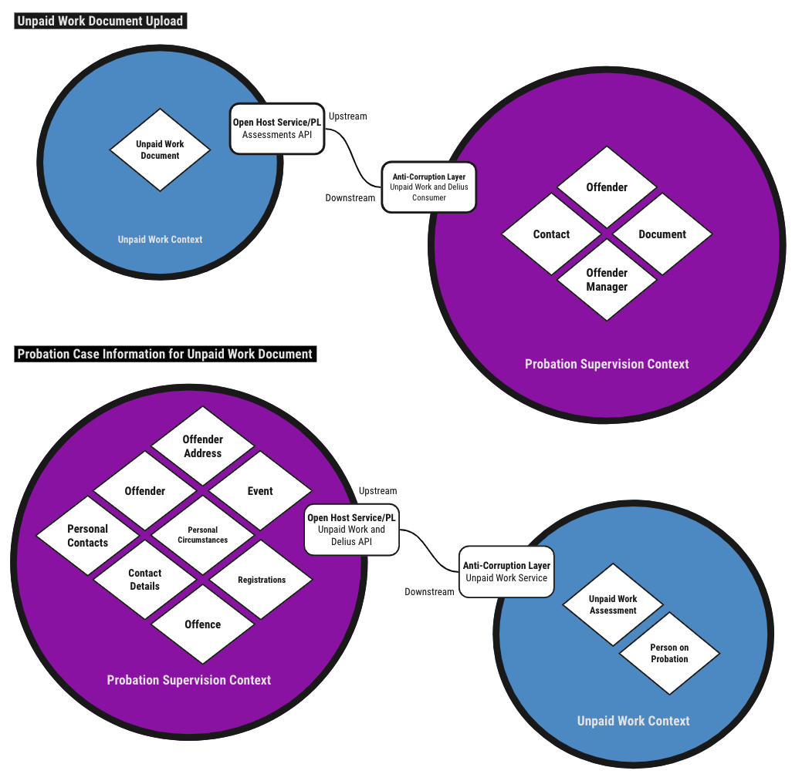

# Unpaid Work and Delius

Service that supports integration between the [Unpaid Work Service](https://github.com/ministryofjustice/hmpps-risk-assessment-ui)
and [Delius](https://github.com/ministryofjustice/delius). The service
provides an API for gathering data on the person on probation and background
information on the probation case. The integration service also listens for
events indicating a new unpaid work document has been completed and is
responsible for updating the Delius case record with a copy of the resulting
unpaid work document.

## Business Need

Supporting the Unpaid Work Service with background and case information used
when placing people on suitable community payback schemes. Ensuring
minimal double-keying is required when working through the unpaid work process
and ensuring the probation case record in Delius is updated to reflect the
activity in the Unpaid Work Service.

## Context Maps

## Interfaces

### Message Formats

The service responds to an HMPPS Domain Event message via an
[SQS Queue](https://github.com/ministryofjustice/cloud-platform-environments/blob/main/namespaces/live.cloud-platform.service.justice.gov.uk/hmpps-probation-integration-services-prod/resources/unpaid-work-and-delius-queue.tf).
The events are raised by the [Unpaid Work Service](https://github.com/ministryofjustice/hmpps-risk-assessment-ui) when
an unpaid work assessment is complete.

Example [messages](./src/dev/resources/messages/) are in the development source tree.

Incoming messages are filtered on `eventType` by the [SQS queue policy](https://github.com/ministryofjustice/cloud-platform-environments/blob/534dd58ad31724df677376d30e72755eb56706c7/namespaces/live.cloud-platform.service.justice.gov.uk/hmpps-probation-integration-services-prod/resources/unpaid-work-and-delius-queue.tf#L5-L7)

| Business Event                   | Message Class      | Message Event Type / Filter        |
|----------------------------------|--------------------|------------------------------------|
| Unpaid Work Assessment Completed | HMPPS Domain Event | "unpaid-work.assessment.completed" |

### Unpaid Work Document

The service uses `detailUrl` contained in the event message to request the
full unpaid work assessment document which is then uploaded to Alfresco and
attached to the case record.

## Authorisation

API endpoints are secured by roles supplied by the HMPPS Auth client used in
the requests

| API Endpoint                      | Required Role      |
|-----------------------------------|--------------------|
| /case-data/{crn}/{eventId}        | ROLE\_UPW\_DETAILS |
| /case-data/{crn}/personal-details | ROLE\_UPW\_DETAILS |
