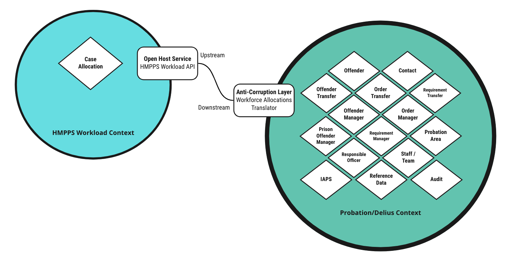

# Workforce Allocations to Delius

Inbound service that responds to workforce allocations events, calls the
[HMPPS Workload Service](https://github.com/ministryofjustice/hmpps-workload)
to determine case allocation status and adds the allocations and transfer
records to Delius. We also add case history contacts to the contact log and
add the necessary audit logs and IAPS events.

## Probation Business Need

The process of allocating cases to probation practitioners is moving to the
HMPPS Workforce service. When these case allocations are actioned they must be
reflected in Delius for the case management activity to proceed.

## Context Map

## Interfaces

### Message Formats

The service responds to various HMPPS Domain Event message via the
[HMPPS Workforce Allocation Queue](https://github.com/ministryofjustice/cloud-platform-environments/blob/main/namespaces/live.cloud-platform.service.justice.gov.uk/hmpps-domain-events-prod/resources/hmpps-workforce-allocation-queue.tf).
The events are raised by the [HMPPS Workload Service](https://github.com/ministryofjustice/hmpps-workload) and indicate the
a person, event or requirement has been allocated to a probation practitioner.

Example [messages](./src/dev/resources/messages/) are in the development source tree.

Incoming messages are filtered on `eventType` by the [SQS queue policy](https://github.com/ministryofjustice/cloud-platform-environments/blob/bf1435995cd59ec9b69e641bd4a1f480a561e178/namespaces/live.cloud-platform.service.justice.gov.uk/hmpps-domain-events-prod/resources/hmpps-workforce-allocation-queue.tf#L72-L77).

### Workforce Allocation Details

The service uses `detailUrl` contained in the message to request details of
the case to be allocated. This URL should reference an instance of the HMPPS
Workload service or a service that provides a response containing workforce
allocation details in the same format.

## Historic Allocations

If the allocation date and time is prior to the date and time of the latest
case allocation in Delius then the details will be added to the historic
record of allocations but the current case allocation will remain in place.

## Event Triggers

Allocation domain events are raised in real time as probation cases are
allocated to a practitioner. The individual elements of the case are raised as
separate events.

| Business Event                        | Message Class      | Message Event Type / Filter          |
|---------------------------------------|--------------------|--------------------------------------|
| Person Allocated to Practitioner      | HMPPS Domain Event | "person.community.manager.allocated" |
| Event Allocated to Practitioner       | HMPPS Domain Event | "event.manager.allocated"            |
| Requirement Allocated to Practitioner | HMPPS Domain Event | "requirement.manager.allocated"            |
